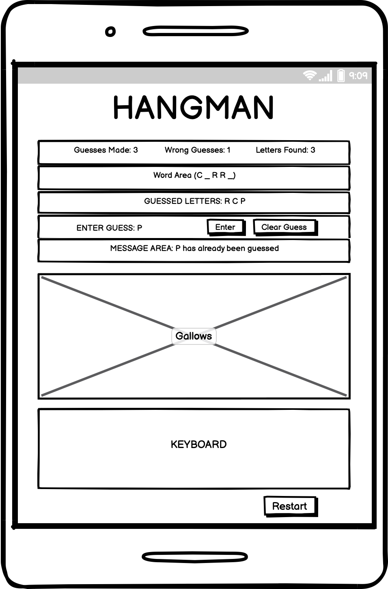
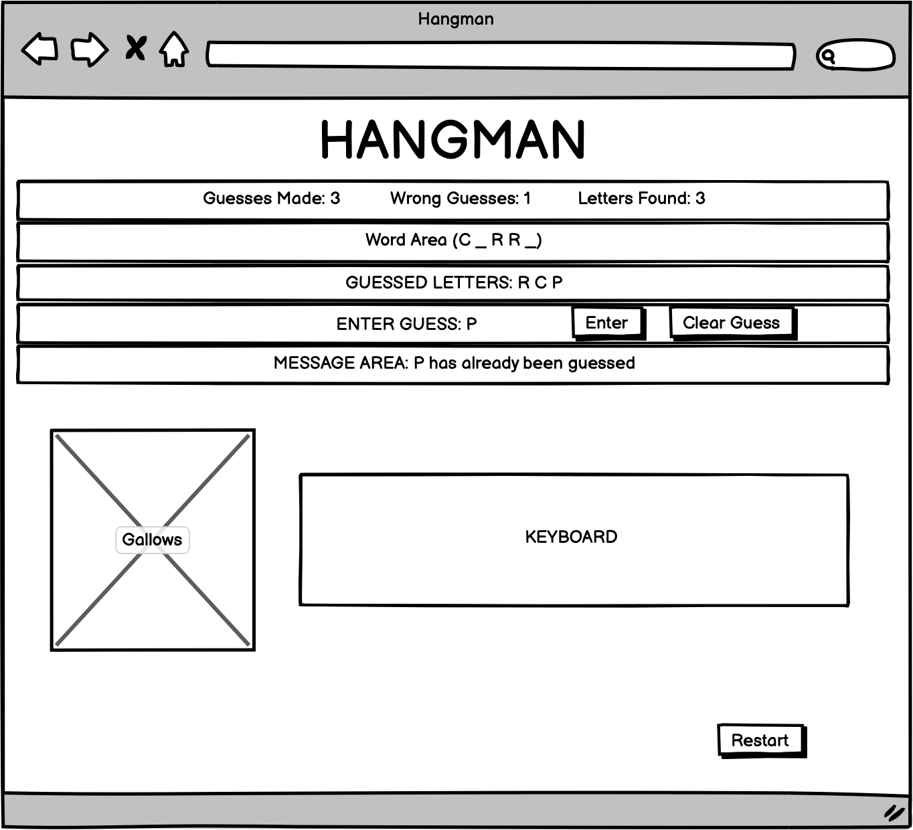

# Hull College


*Image created and taken from [Am I Responsive?](ami.responsivedesign.is).*

[View the live project here](https://mjjstockman.github.io/hull-college).

---

## Table of contents

1. [Introduction](#Introduction)
2. [UX and Design](#UX-and-design)
   - [User Demographics](#User-Demographics)
   - [User Stories](#User-Stories)
   - [Wireframes](#Wireframes)
   - [Colour Scheme](#Colour-Scheme)
   - [Typography](#typography)
3. [Features](#Features)
   - [Navigation and Header](#Navigation-and-Header)
   - [Hero Image](#Hero-Image)
   - [About Information Box](#About-Information-Box)
   - [Award Winning and Student Satisfaction](#Award-Winning-and-Student-Satisfaction)
   - [About Information Box](#About-Information-Box)
   - [Courses Section](#Courses-Section)
   - [Contact Section](#Contact-Section)
   - [Footer](#Footer)
4. [Future Features](#Features-to-Implement-in-the-future)
5. [Testing](#Testing)
6. [Deployment](#Deployment)
   - [How the site was Deployed](#How-the-site-was-Deployed)
   - [How to Fork the Repository](#How-to-Fork-the-Repository)
   - [How to create a Clone](#How-to-create-a-Clone-using-SSH)
7. [Credits](#Credits)
   - [Images](#Images)
   - [Acknowledgements](#Acknowledgements)

---

# Introduction

The following is a game of Hangman, with the logic created using JavaScript.

[Back to top ⇧](#Hull-College)

# UX and Design

## User Demographics

The target market are individuals who want to play a quick game as a short distraction.  It is focused towards younger players, so a lot of guesses are allowed before the game is over.


## User Stories

1. As a gamer, I want to quickly tell what the game is, so I can see if I want to play it.

2. As a gamer, I want to be able to either win or loose, so I am motivated to try my best.

3. As a gamer, I want to be able to enter a guess using either my keyboard or by clicking on a button, so I can play in a way that best suits me.

4. As a gamer, I want visual representation on how well I am doing, so that I am kept engaged and can easily see my progress.

5. As a gamer, I want to be able to restart a game easily, so that I don't have to refresh the browser to start a new game whilst I am already playing.

[Back to top ⇧](#Hull-College)

## Wireframes

| Under 500px width | Over 500px width |
| --------------| -------------- | 
|  |  |

*Images created and taken from [Balsamiq](https://balsamiq.com/wireframes)*

[Back to top ⇧](#Hull-College)

  

## Colour Scheme

Black and white were mainly used, to convey a child like, hand-drawn aesthetic.  The message area has a red text colour to draw attention and add a warning-like effect.  The main colours used are shown below:

- Message Area: #f52424 
- Disabled button text: #E2EC0D 
- Body and Buttons: #110E0D 


[Back to top ⇧](#Hull-College)

## Typography

[Google Fonts](https://fonts.google.com/specimen/Indie+Flower) was used to find a hand-drawn style font.  A fallback option of cursive.


[Back to top ⇧](#Hull-College)

# Features

## Navigation and Header

The navigation bar allows the user to easily select which area of the site they wish to view. It will be located at the top of the site as this is common practice and is the area where most users eyes will be initially drawn to. It will be 'sticky', meaning it will stay at the top of the users screen even when they scroll the site. This is because the site is a one-page design and it is essential for the user to always be able to navigate the site wherever their current position. When a link is hovered over it becomes underlined to help the user confirm they are about to select the relevant link. The underline remains once selected and the relevant navigation link is highlighted when the site is scrolled.

The 'hamburger' icon was not used on small screens (where the navigation bar will collapse and be represented as three horizontal lines. When touched/clicked, this would reveal the navigation in a dropdown menu). This is often done due to the limited real estate space making the text hard to read when the screen is this size. However, this design was not used to make the site more easy to navigate for all users. Furthermore, the navigation only contains three links, so they have the space to remain next to each other still on small screens without causing accessibility and design issues. However, the logo will be centered and the navigation drop below at a particular screen width.


[Back to top ⇧](#Hull-College)

## Hero Image

An eye-catching full screen image is placed under the navigation. This helps grab the users attention and convey positive, professional feelings.


[Back to top ⇧](#Hull-College)

## About Information Box

A small box containing introductory information is placed below the hero image. This is eye-catching and quickly confirms to the user that they are on the correct site. It offers general information on the college, so users quickly get a feel for its achievements.


[Back to top ⇧](#Hull-College)

## Award Winning and Student Satisfaction

A brief description of the four awards the college has won is displayed under cartoon images of awards. Beneath these are statistics of student success and recommendations. These help to install confidence in the quality of the college and help conversion rates of those viewing the site to enrol. Larger screens display the awards and statistics four in a row, reducing to two and then stacked on top of each other as screens get smaller. This is to give the user the best experience in terms of accessibility and usability. These sections mirror each other to help give the site a sense of balance.


***


[Back to top ⇧](#Hull-College)

## Courses Section

This section contains images for the courses available at the college, so users can quickly see if they offer a course they are interested in. Icons from Font Awesome are used for the courses to add visual interest and to make each course quickly identifiable and more memorable. On large screens the courses are displayed three in a row, changing to two and then one as the screen gets smaller.


[Back to top ⇧](#Hull-College)

## Contact Section

This section allows the user to easily contact the college by using a form to send a message. The fields are clearly marked, all required and the email field must contain a valid email. The message is limited to 400 characters to keep them succinct and reduce the amount of characters needed to be stored in the database. The Submit button is a bright distinctive colour, acting as a call to action for the user.

A map showing the college's location is also included in this section, allowing users to quickly identify where the college is based.


*Please note the empty box on the left displays a map on the deployed site.*

[Back to top ⇧](#Hull-College)

## Footer

The footer feature at the bottom of the page contains links to Hull Colleges social media links. This will help users find more information and stay up to date with the college. The links open in a new tab, so users are not taken away from Hull College's website. They are the same colour as those in the navigation for consistency and to help them stand out.


[Back to top ⇧](#Hull-College)

# Features to Implement in the future

Add a dropdown to each course in the Courses section containing information on the course.

Add script to dynamically display how many characters are left for the form textarea.

Remove inline JavaScript in index.html into a separate script folder.  This was not done as it was outside the scope of the project.
 
The active navigation highlighting does not always work correctly on scroll.  This feature was not fixed as the use of JavaScript is outside the scope of the project.

# Technologies Used

## Main Languages Used

- HTML
- CSS

[Back to top ⇧](#Hull-College)

## Additional Languages Used

- JavaScript was used to change the highlighted navigation link on scroll.

[Back to top ⇧](#Hull-College)

# Testing

Details on site testing can be found [here](TESTING.md).

[Back to top ⇧](#Hull-College)

# Deployment

## How the site was Deployed

The code was deployed to GitHub Pages in the following way:

1. Log into [GitHub](https://github.com/login) or [create an account](https://github.com/join).
2. Select the [GitHub Repository](https://github.com/mjjstockman/hull-college).
3. Open Settings by clicking on the Settings link (with the cog icon).
4. Scroll down to the GitHub Pages section and click on the link.
   
5. Click the dropdown box in the Source section (which currently states "none") and select master (this may be named "main" for some users).
   
6. Click Save.
7. The URL address for the deployed site will be shown.
   

[Back to top ⇧](#Hull-College)

## How to Fork the Repository

1. Log into [GitHub](https://github.com/login) or [create an account](https://github.com/join).
2. Select the [GitHub Repository](https://github.com/mjjstockman/hull-college).
3. Click "Fork" at the top right of the page.
4. The repository will be copied into your GitHub account.

[Back to top ⇧](#Hull-College)

## How to create a Clone using SSH

1. Log into [GitHub](https://github.com/login) or [create an account](https://github.com/join).
2. Select the [GitHub Repository](https://github.com/mjjstockman/hull-college).
3. Click on the Code button.
4. Copy the provided SSH link.
   
5. Open Terminal.
6. Navigate into the directory you want to clone the repositroy to.
7. Type git clone and paste the copied URL.

```
$ git clone https://github.com/mjjstockman/hull-college
```

8. Press **Enter**.

[Back to top ⇧](#Hull-College)

# Credits

Many thanks to the following which were used throughout the creation of this site:

- [w3c Markup Validator](https://validator.w3.org)
- [Adobe Stock Image](https://stock.adobe.com)
- [Am I Responsive?](http://ami.responsivedesign.is)
- [Balsamiq](https://balsamiq.com/)
- [Coolors](https://coolors.co/)
- [Design Course tutorial](https://www.youtube.com/watch?v=z9H7p1_iI14)
- [Embed My Map](https://www.embedmymap.com/)
- [Favicon.io](https://favicon.io)
- [Font Awesome](https://fontawesome.com)
- [Free Formatter](https://www.freeformatter.com/)
- [Google Fonts](https://fonts.google.com)
- [Git](https://git-scm.com)
- [GitHub](https://github.com)
- [Json Formatter](https://jsonformatter.org/markdown-formatter)
- [Lighthouse](https://developers.google.com/web/tools/lighthouse)
- [Looka](https://looka.com/)
- [Malsu Codepen](https://codepen.io/malsu/pen/VwKzoPG)
- [Pexels](https://www.pexels.com)
- [Placeholder.com/](https://placeholder.com)
- [Responsinator](http://www.responsinator.com)
- [Squoosh](https://squoosh.app)
- [Super Cool Design](https://supercooldesign.co.uk/blog/how-to-write-good-alt-text)
- [TinyPNG](https://tinypng.com)
- [Typespiration](https://typespiration.com)


[Back to top ⇧](#Hull-College)

## Images

The Hero image was taken from [Adobe Stock Image](https://stock.adobe.com/).

All other images were taken from [Pexels](https://www.pexels.com/).

[Back to top ⇧](#Hull-College)

## Acknowledgements

- Many thanks to my mentor for guidance.
- Thank you to the Code Institute Slack community for their advice.
- A wonderful [README.md](https://github.com/rebeccatraceyt/KryanLive) by [Rebecca Tracey-Timoney](https://github.com/rebeccatraceyt) was used for inspiration and guidance.

[Back to top ⇧](#Hull-College)
