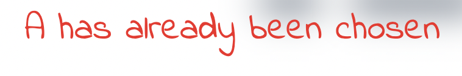

# Hull College


*Image created and taken from [Am I Responsive?](ami.responsivedesign.is).*

[View the live project here](https://mjjstockman.github.io/hull-college).

---

## Table of contents

1. [Introduction](#Introduction)
2. [UX and Design](#UX-and-design)
   - [User Demographics](#User-Demographics)
   - [User Stories](#User-Stories)
   - [Wireframes](#Wireframes)
   - [Colour Scheme](#Colour-Scheme)
   - [Typography](#typography)
3. [Features](#Features)
   - [Navigation and Header](#Navigation-and-Header)
   - [Hero Image](#Hero-Image)
   - [About Information Box](#About-Information-Box)
   - [Award Winning and Student Satisfaction](#Award-Winning-and-Student-Satisfaction)
   - [About Information Box](#About-Information-Box)
   - [Courses Section](#Courses-Section)
   - [Contact Section](#Contact-Section)
   - [Footer](#Footer)
4. [Future Features](#Features-to-Implement-in-the-future)
5. [Testing](#Testing)
6. [Deployment](#Deployment)
   - [How the site was Deployed](#How-the-site-was-Deployed)
   - [How to Fork the Repository](#How-to-Fork-the-Repository)
   - [How to create a Clone](#How-to-create-a-Clone-using-SSH)
7. [Credits](#Credits)
   - [Images](#Images)
   - [Acknowledgements](#Acknowledgements)

---

# Introduction

The following is a game of Hangman, with the logic created using JavaScript.

[Back to top ⇧](#Hull-College)

# UX and Design

## User Demographics

The target market are individuals who want to play a quick game as a short distraction.  It is focused towards younger players, so a lot of guesses are allowed before the game is over.


## User Stories

1. As a gamer, I want to quickly tell what the game is, so I can see if I want to play it.

2. As a gamer, I want to be able to either win or loose, so I am motivated to try my best.

3. As a gamer, I want to be able to enter a guess using either my keyboard or by clicking on a button, so I can play in a way that best suits me.

4. As a gamer, I want visual representation on how well I am doing, so that I am kept engaged and can easily see my progress.

5. As a gamer, I want to be able to restart a game easily, so that I don't have to refresh the browser to start a new game whilst I am already playing.

[Back to top ⇧](#Hull-College)

## Wireframes

| Under 500px width | Over 500px width |
| --------------| -------------- | 
|  |  |

*Images created and taken from [Balsamiq](https://balsamiq.com/wireframes)*

[Back to top ⇧](#Hull-College)

  

## Colour Scheme

Black and white were mainly used, to convey a child like, hand-drawn aesthetic.  The message area has a red text colour to draw attention and add a warning-like effect.  The main colours used are shown below:

- Message Area: #f52424 
- Disabled button text: #E2EC0D 
- Body and Buttons: #110E0D 


[Back to top ⇧](#Hull-College)

## Typography

[Google Fonts](https://fonts.google.com/specimen/Indie+Flower) was used to find a hand-drawn style font.  A fallback option of cursive is used.


[Back to top ⇧](#Hull-College)

# Features

## Score Area

The score area displays the number of Guesses Made, Wrong Guesses and Letters Found.  This is placed at the top, below the heading as it displays important information to the user.  The innerHTML of this area is also used to track game logic, such as the correct gallows image to show, when all letters have been guessed and when the game is over.


[Back to top ⇧](#Hull-College)

## Word Area

This area holds the word for the user to guess.  Before any letters are correctly guessed they are displayed as underscores.  These are then replaced with the guessed letters.


[Back to top ⇧](#Hull-College)

## Guessed Area

The guessed area shows the letters previously guessed.  This helps the user not attempt to choose a letter that has already been picked.  It's innerHTML is also used to check this within the code.


[Back to top ⇧](#Hull-College)

## Guess Area

This area prompts the user to enter a letter via their keyboard.  If a letter is entered it is displayed.  This can then be deleted by either clicking on the #clear-btn or pressing the backspace key on the users keyboard.  Clicking the #submit-btn or pressing the enter key checks to make sure a letter has been entered.  If so the letter is checked to make sure it has not already been selected and then passed to the #guessed-area.  If a letter has not been entered an error message is displayed in the #message-area.  


## Message Area
Messages to the user are displayed here.  These either state that no letter has been entered or that a letter has already been chosen.



## Gallows Area
The gallows area displays the image of the gallows and hangman.  It starts off blank and is dynamically updated using the innerHTML of the #wrong-guesses span.


## Keyboard Area
Buttons for the user to click are displayed in this area, which are generated via JavaScript.  This offers the user a different input option, where they can click the buttons rather then using their keyboard.  Once a letter is selected, either by clicking a button or via the users keyboard, the corresponding button is disabled.   


***

# Features to Implement in the future

Add numerous themes for the words the user can select.

Add the default keyboard for mobile sizes.


# Technologies Used

## Main Languages Used

- HTML
- CSS
- JavaScript

[Back to top ⇧](#Hull-College)

# Testing

Details on site testing can be found [here](TESTING.md).

[Back to top ⇧](#Hull-College)

# Deployment

## How the site was Deployed

The code was deployed to GitHub Pages in the following way:

1. Log into [GitHub](https://github.com/login) or [create an account](https://github.com/join).
2. Select the [GitHub Repository](https://github.com/mjjstockman/hull-hangman).
3. Open Settings by clicking on the Settings link (with the cog icon).
4. Scroll down to the GitHub Pages section and click on the link.
5. Click the dropdown box in the Source section (which currently states "none") and select master (this may be named "main" for some users).
6. Click Save.
7. The URL address for the deployed site will be shown.


[Back to top ⇧](#Hull-College)

## How to Fork the Repository

1. Log into [GitHub](https://github.com/login) or [create an account](https://github.com/join).
2. Select the [GitHub Repository](https://github.com/mjjstockman/hangman).
3. Click "Fork" at the top right of the page.
4. The repository will be copied into your GitHub account.

[Back to top ⇧](#Hull-College)

## How to create a Clone using SSH

1. Log into [GitHub](https://github.com/login) or [create an account](https://github.com/join).
2. Select the [GitHub Repository](https://github.com/mjjstockman/hangman).
3. Click on the Code button.
4. Copy the provided SSH link.
5. Open Terminal.
6. Navigate into the directory you want to clone the repository to.
7. Type git clone and paste the copied URL.

```
$ git clone https://github.com/mjjstockman/hangman
```

8. Press **Enter**.

[Back to top ⇧](#Hull-College)

# Credits

Many thanks to the following which were used throughout the creation of this site:

- [w3c Markup Validator](https://validator.w3.org)
- [Adobe Stock Image](https://stock.adobe.com)
- [Am I Responsive?](http://ami.responsivedesign.is)
- [Balsamiq](https://balsamiq.com/)
- [Coolors](https://coolors.co/)
- [Design Course tutorial](https://www.youtube.com/watch?v=z9H7p1_iI14)
- [Embed My Map](https://www.embedmymap.com/)
- [Favicon.io](https://favicon.io)
- [Font Awesome](https://fontawesome.com)
- [Free Formatter](https://www.freeformatter.com/)
- [Google Fonts](https://fonts.google.com)
- [Git](https://git-scm.com)
- [GitHub](https://github.com)
- [Json Formatter](https://jsonformatter.org/markdown-formatter)
- [Lighthouse](https://developers.google.com/web/tools/lighthouse)
- [Looka](https://looka.com/)
- [Malsu Codepen](https://codepen.io/malsu/pen/VwKzoPG)
- [Pexels](https://www.pexels.com)
- [Placeholder.com/](https://placeholder.com)
- [Responsinator](http://www.responsinator.com)
- [Squoosh](https://squoosh.app)
- [Super Cool Design](https://supercooldesign.co.uk/blog/how-to-write-good-alt-text)
- [TinyPNG](https://tinypng.com)
- [Typespiration](https://typespiration.com)


[Back to top ⇧](#Hull-College)

## Images

The Hero image was taken from [Adobe Stock Image](https://stock.adobe.com/).

All other images were taken from [Pexels](https://www.pexels.com/).

[Back to top ⇧](#Hull-College)

## Acknowledgements

- Many thanks to my mentor for guidance.
- Thank you to the Code Institute Slack community for their advice.
- A wonderful [README.md](https://github.com/rebeccatraceyt/KryanLive) by [Rebecca Tracey-Timoney](https://github.com/rebeccatraceyt) was used for inspiration and guidance.

[Back to top ⇧](#Hull-College)
