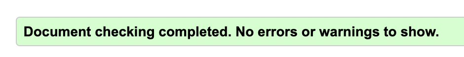
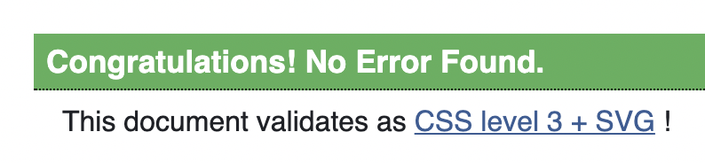
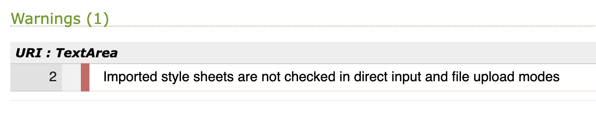

# Hangman Testing

***

# Table of Contents

1. [Testing User Stories](#Testing-User-Stories)
2. [Manual Testing](#Manual-Testing)
   - [Checking Responsiveness](#Checking-the-Responsiveness)
   - [Browser Validation](#Browser-Validation)
3. [Automated Testing](#Automated-Testing)
   - [Code Validation](#Code-Validation)
4. [User Testing](#User-Testing)
5. [Issues and Bugs](#Issues-and-Bugs)

***

# Testing User Stories

[Back to top ⇧](#Hangman-Testing)

1. **As a gamer, I want to quickly tell what the game is, so I can see if I want to play it.**

   - The page clearly shows a heading with the text of HANGMAN. 
   - The classic layout with underscores for letters is displayed.
  

2. **As a gamer, I want to be able to either win or loose, so I am motivated to try my best.**

   - The game is over when the number of wrong guesses equals 10.
   - The game is won when the number of letters found equals the number of characters in the word.

3. **As a gamer, I want to be able to enter a guess using either my keyboard or by clicking on a button, so I can play in a way that best suits me.**

   - User input can be given either by the buttons in the #keyboard-area being clicked or the user pressing a key on their keyboard.

   - The guessed area can be cleared by either clicking the #clear-btn or pressing backspace.

4. **As a gamer, I want visual representation on how well I am doing, so that I am kept engaged and can easily see my progress.**

   - The gallows image is updated after a wrong guess.

   - The number of wrong guesses is shown in the score area.

 5. **As a gamer, I want to be able to restart a game easily, so that I don't have to refresh the browser to start a new game whilst I am already playing.**

    - A restart button is clearly displayed at the bottom of the page.

[Back to top ⇧](#Hangman-Testing)

# Manual Testing

- The word is randomly selected.

- All updates within the score area are working.

- Button hover and disabling works.

- All buttons are working.

## Checking the Responsiveness

[Responsinator](http://www.responsinator.com) was used to check the following responsive features:

- The keyboard is positioned next to the gallows image @min 500px.

- All font-size increases work.

[Back to top ⇧](#Hangman-Testing)

## Browser Validation

The site was tested on the following browsers:

- Chrome
- Safari 
- Opera
- Firefox

# Automated Testing

## Code Validation

### HTML

The [W3C Markup Validator](https://validator.w3.org/) was used to validate the HTML. No errors or warnings were found.

### CSS

The [W3C CSS Validator](https://jigsaw.w3.org/css-validator) was used to validate the CSS and no errors were found. 

 One warning was issued, stating imported style sheets were not validated.  This was not acted upon as it was deemed to be an acceptable warning.

[Back to top ⇧](#Hangman-Testing)

# User Testing

Numerous peers and friends helped to review the site and its development.

[Back to top ⇧](#Hangman-Testing)

# Issues and Bugs

## Functions called twice
When the focus was on the submit button and the user pressed the enter key on their keyboard the submit button was clicked twice (once for the enter keydown and again for the button click).  This was dealt with by removing the documents active focus when the user presses their enter key on their keyboard.

Further research has suggested that this was not the best approach from a UX point of view and an alternative solution should be found in the future.

## keyCode deprecated
keyCode was used to capture the character the user presses on their keyboard.  Research showed that this method has been deprecated and it is suggested to use key instead.  However, keyCode was checked using [caniuse](https://caniuse.com/) and found to still be widely supported so it was not changed.

[Back to top ⇧](#Hangman-Testing)
